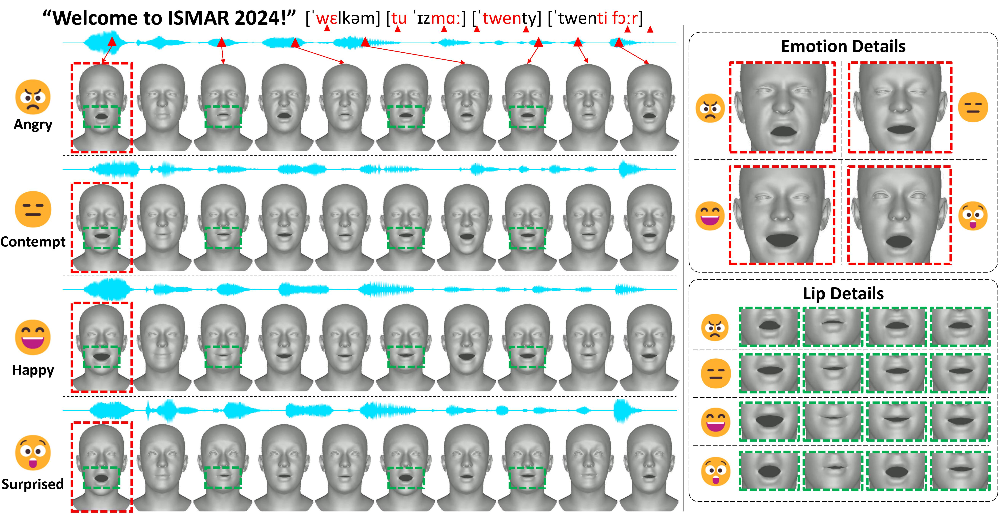
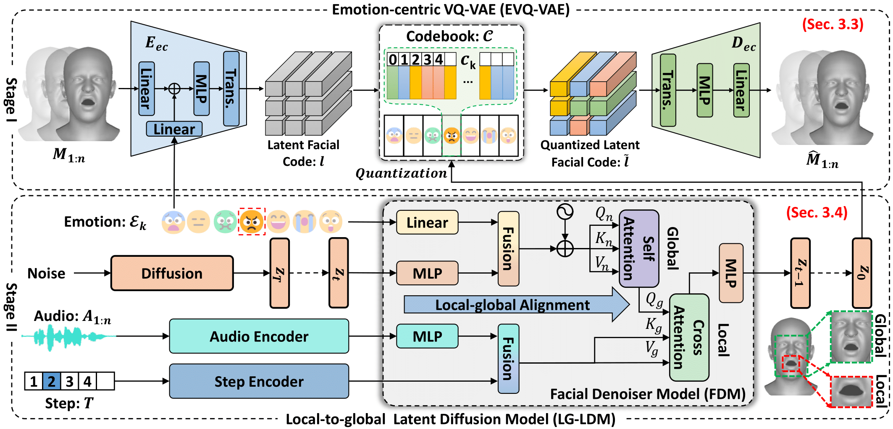

# **Expressive 3D Facial Animation Generation Based on Local-to-global Latent Diffusion**

Official PyTorch implementation for the paper:

> **Expressive 3D Facial Animation Generation Based on Local-to-global Latent Diffusion [TVCG 2024]**
>
> Wenfeng Song*, Xuan Wang, Yiming Jiang, Shuai Li*, Aimin Hao, Xia Hou, and Hong Qin

<p align="center">

</p>

Our method generates realistic facial animations by syncing lips with audio and capturing various subtle expressions. It aligns detailed facial movements, from overall facial expressions to mouth movements, closely with the accompanying audio.

## The Pipeline of Our Method

<p align="center">

</p>

The upper part is the EVQ-VAE of the first stage, which is used to obtain the local and global discrete priors. The lower part is the second stage of LG-LDM, which generates facial latent code through the diffusion process, and FDM is the facial denoiser model, which aligns the local-to-global animation with audio.

## **Environmental Preparation**

- Ubuntu 20.04+ (Linux)
- Python 3.8+
- Pytorch 1.9.1+
- CUDA 11.7 (GPU with at least 12GB VRAM)
- ffmpeg
- [MPI-IS/mesh](https://github.com/MPI-IS/mesh)

Create a new conda environment:
```
conda create -n FDM python=3.8
conda activate FDM
```

Then install the necessary packages:
```
pip install -r requirements.txt
```

## **Dataset Preparation**

### 3D MEAD Dataset
The [MEAD dataset](https://wywu.github.io/projects/MEAD/MEAD.html), initially designed for emotionalized speech-face generation research, has been repurposed in our study to generate 3D facial animations. This necessitates the conversion of the 2D MEAD dataset into a 3D MEAD dataset, a process achieved through reconstruction using [EMOCA](https://github.com/radekd91/emoca). Moreover, we discard the identity of humans for simplification. Given the extensive data in the MEAD dataset, we selectively utilize Level 3’s M003 through M0040, excluding the neutral section, to concentrate on generating emotional 3D facial animations. The dataset is subsequently divided into a training set 3D MEAD-Train (M003 to M034), a verification set 3D MEAD-Val (M035 and M039), and a test set 3D MEAD-Test (M037 and M040). Please download the 3D MEAD dataset from [Baidu Cloud Driven](链接：https://pan.baidu.com/s/1aVAsAYywG9Jp2vEV3T1XNg?pwd=utck) and put it in the `MEAD` folder.


### VOCASET
Request the VOCASET data from [https://voca.is.tue.mpg.de/](https://voca.is.tue.mpg.de/). Place the downloaded files `data_verts.npy`, `raw_audio_fixed.pkl`, `templates.pkl` and `subj_seq_to_idx.pkl` in the folder `vocaset/`. Download "FLAME_sample.ply" from [voca](https://github.com/TimoBolkart/voca/tree/master/template) and put it in `vocaset/`. Read the vertices/audio data and convert them to .npy/.wav files stored in `vocaset/vertices_npy` and `vocaset/wav`:
```
cd vocaset
python process_voca_data.py
```

### BIWI

Follow the [`BIWI/README.md`](BIWI/README.md) to preprocess BIWI dataset and put .npy/.wav files into `BIWI/vertices_npy` and `BIWI/wav`, and the `templates.pkl` into `BIWI/`.

## **Demo Test**

Download the two stages pretrained models from [3D MEAD](https://drive.google.com/drive/folders/1IYVyYp35ueNbXZ3XFbugFMYhTw6PBVJ8?usp=drive_link)([Baidu Drive](https://pan.baidu.com/s/1aVAsAYywG9Jp2vEV3T1XNg?pwd=utck)), [VOCASET](https://drive.google.com/drive/folders/1IYVyYp35ueNbXZ3XFbugFMYhTw6PBVJ8?usp=drive_link), and [BIWI](https://drive.google.com/drive/folders/1IYVyYp35ueNbXZ3XFbugFMYhTw6PBVJ8?usp=drive_link). Put the pretrained models under `MEAD`, `VOCASET`, and `BIWI` folders, respectively.

- To animate a video in 3D MEAD under different emotion, run: 
	```
	python demo/demo_3d_mead.py --audio_file <audio_path> --emotion <angry|contempt|disgusted|fear|
    happy|sad|surprised>
	```

- To animate a video in VOCASET dataset, run: 
	```
	python demo/demo_vocaset.py --audio_file <audio_path>
	```

- To animate a video in BIWI dataset, run: 
	```
	python demo/demo_biwi.py --audio_file <audio_path>
	```
## **Training the models**
Once we have all our data sets in place, we can train our two stages as follows:
- Training the EVQ-VAE model:
    ```
    python train/train_<mead|vocaset|biwi>_vqvae.py
    ```
- Training the LG-LDM model:
    ```
    python train/train_diffusion_<mead|vocaset|biwi>.py
    ```

## **Test the models**
After training the models, we can test them as follows:

- Testing the EVQ-VAE model:
    ```
    python sample/sample_<mead|vocaset|biwi>_vqvae.py
    ```

- Testing the LG-LDM model:
    ```
    python sample/sample_diffusion_<mead|vocaset|biwi>.py
    ```

## **Acknowledgement**

We heavily borrow the code from
[FaceFormer](https://github.com/EvelynFan/FaceFormer),
[CodeTalker](https://github.com/RenYurui/PIRender), and [VOCA](https://github.com/TimoBolkart/voca). Thanks
for sharing their code and [huggingface-transformers](https://github.com/huggingface/transformers/blob/main/src/transformers/models/wav2vec2/modeling_wav2vec2.py) for their HuBERT implementation. We also gratefully acknowledge the ETHZ-CVL for providing the [MEAD](https://wywu.github.io/projects/MEAD/MEAD.html) dataset and MPI-IS for releasing the [VOCASET](https://voca.is.tue.mpg.de/) dataset. Any third-party packages are owned by their respective authors and must be used under their respective licenses.
